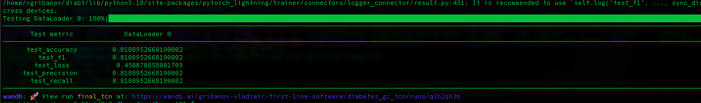
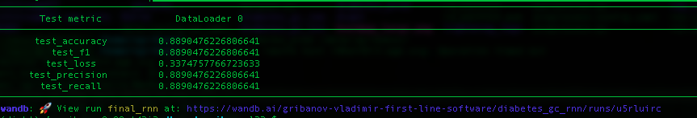

# Predictive modeling in Diabetes (work-in-progress)

## Introduction

The repository contains the code for the predictive modeling in readmission risks and A1C1 level of patients with giving medical data (procedure codes, diagnoses codes, labs measurements, vitals measurements, admits).


## Requirements

This code has been tested on:

- Ubuntu 22.04.4 LTS
- Python 3.10.12
- PyTorch 2.2.1 compiled for CUDA 12.1 and cuDNN 8.9.7 ([Instructions for Pytorch 2 and CUDA 11.8](https://gist.github.com/MihailCosmin/affa6b1b71b43787e9228c25fe15aeba#file-cuda_11-8_installation_on_ubuntu_22-04)) ([CUDA 12.1](https://developer.nvidia.com/cuda-12-1-0-download-archive?target_os=Linux&target_arch=x86_64&Distribution=Ubuntu&target_version=22.04&target_type=deb_network)) ([cuDNN v8.9.7](https://developer.nvidia.com/rdp/cudnn-archive)) ([cuDNN instructions](https://docs.nvidia.com/deeplearning/cudnn/archives/cudnn-897/install-guide/index.html)) or PyTorch 2.3.1 compiled for CUDA 12.4 and cuDNN 9.2.0. 

Note: it is recommended to install PyTorch in a python virtual environment (see Getting started).

## Hardware

NVIDIA Driver Version: 550.54.15 or 550.90.07

CUDA Version: 12.1 or 12.4

GPUs: GeForce RTX 2080 (x2) or NVIDIA RTX 6000 Ada Generation (x3)

## Code Files in `src/`

The A1C1 models (TCN and RNN) are implemented in code that placed in `src/a1c1/` directory. The code files are:

- tcn.py (TCN model)
- rnn.py (RNN model)
- pattention.py (self-attention layer implementation for the models)
- dataset.py (dataset class for the models)
- preprocess.py (preprocessing script for the models)
- train.py (training script for the models)
- analysis.py (analysis script for the models (load/create analysis database))

## Config files

- preprocess_config.yaml (config file for the preprocessing)
- tune-config.yaml (config file for the hyperparameter tuning)

## Notebooks

- tcn_models.ipynb (notebook for the TCN models)
- rnn_models.ipynb (notebook for the RNN models)
- train.ipynb (notebook for the training (do not use, instead use train.py and run it trough ssh on the server))
- analyze.ipynb (notebook for the analysis results of the predictions and plots generation)

## Getting started ([credit](https://gist.github.com/Ravi2712/47f070a6578153d3caee92bb67134963))

1. Check if `pip` is installed:

```bash
$ pip3 --version

#If `pip` is not installed, follow steps below:
$ cd ~
$ curl https://bootstrap.pypa.io/get-pip.py -o get-pip.py
$ python3 get-pip.py
```

2. Install virtual environment first & then activate:

```bash
$ python3 -m pip install --user virtualenv #Install virtualenv if not installed in your system
$ python3 -m virtualenv env10 #Create virtualenv for your project
$ source env10/bin/activate #Activate virtualenv for linux/MacOS
```

3. Install PyTorch via pip by running following command:

```bash
# CUDA 12.1
$ pip3 install torch==2.2.1 torchvision==0.17.1 torchaudio==2.2.1 --index-url https://download.pytorch.org/whl/cu121
# CUDA 12.4: https://github.com/pytorch/pytorch#from-source
```

4. Clone project repo and install other dependencies from `requirements.txt` file:

```bash
$ git clone https://github.com/VGSML/diabetes-pred.git
$ pip3 install -r diabetes-pred/requirements.txt
```

5. Install and init wandb.ai logger (<https://wandb.ai/>):

```bash
$ pip3 install wandb
$ wandb login
```

## Usage

### A1C1 models

To prepare data for the a1c1 models, should be loaded the files with source data (outcomes, diagnoses, procedures, labs) and run the following command:

```bash
$ cd diabetes-pred/src/a1c1/
$ python3 preprocess.py --config preprocess_config.yaml
```

To train the a1c1 models, run the following command:

```bash
$ cd diabetes-pred/src/a1c1/
$ python3 train.py --ds_path /data/vgribanov/data/a1c1/final_data --num_epochs=25 --batch_size=32 --lr=0.0001 --tcn_layers=16,32,64 --save /data/vgribanov/a1c1/models/final/tcn.model --run_name=final_tcn
$ python3 train.py --ds_path /data/vgribanov/data/a1c1/final_data --num_epochs=25 --batch_size=32 --lr=0.0001 --model_type=RNN --rnn_layers=3 --rnn_hidden_dim=64  --save /data/vgribanov/a1c1/models/final/rnn.model --run_name=final_rnn
```


